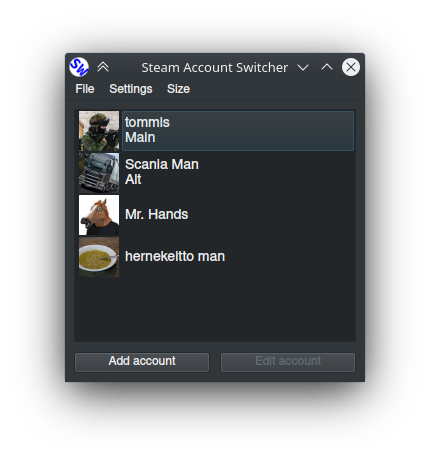

# Steam account switcher

A GUI program to quickly switch between many steam accounts for ~~Linux~~ (coming) and Windows.

Your login info is stored in steam installation directory in the files starting with ssfn so this program doesn't actually know your password.

## GUI

Run with `python main.py`

## Command line usage

Run with

`python main.py`

Flags  (TODO)

* `-login USERNAME`

* `-add USERNAME` or `-add USERNAME,USERNAME,USERNAME...`

* `-remove/-delete USERNAME`

* `-list`

* `-about`

## Settings file

`changer.json` inside program install dir.

- `"behavior_after_login"` values:
    - *minimize* (default)
    - *close*
    - *minimize_tray*
- `"theme"` values:
    - *dark* (default)
    - *light*
- `"steam_api_key"` used for getting steam avatars and profile pages. Get yours from [steam](https://steamcommunity.com/dev/apikey)
- `"users"` object
    - `login_name` the unique name you use for login
        - `comment` free text to display in list
        - `display_order` position in witch to display account
        - `steam_skin` name of theme you want this account to use
            - `C:\Program Files (x86)\Steam\skins` on windows
            - `~/.steam/skins` or `~/.local/share/Steam/skins/` on Linux
        - `steam_user` object returned by [ISteamUser#GetPlayerSummaries](https://partner.steamgames.com/doc/webapi/ISteamUser#GetPlayerSummaries)
        - `timestamp` unix time at the time of addition

## TODO

- [ ] Command line interface
- [ ] Linux
- [ ] Code refactoring
- [ ] Status bar
- [ ] Size menu
        
## Requirements & installation

- python3+
- pyside2
- pyvdf
- requests
